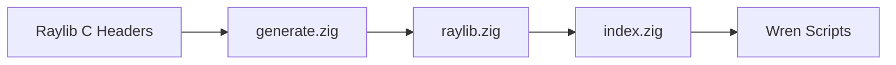

Talon uses a semi-automated binding generation system to expose Raylib functions to Wren. This guide explains how the system works and how to add new bindings.

## Architecture Overview

The binding system consists of three layers:

1. **Generator** (`src/bindings/generate/generate.zig`) - Parses C headers and generates Zig code
2. **Generated Bindings** (`src/bindings/raylib.zig`) - Auto-generated Zig wrapper functions
3. **Binding Registry** (`src/bindings/index.zig`) - Maps Wren signatures to Zig functions



## How Bindings Work

### 1. Wren Signature Format

Bindings use a specific signature format in the registry:

```zig title="src/bindings/index.zig:13-16"
pub const ForeignMethodBindings = std.StaticStringMap(?*const WrenForeignMethodFn).initComptime(.{
    .{ "raylib.Raylib.initWindow(_,_,_)", RaylibBindings.wren_raylib_init_window },
    .{ "raylib.Raylib.closeWindow()", RaylibBindings.wren_raylib_close_window },
    .{ "raylib.Raylib.windowShouldClose()", RaylibBindings.wren_raylib_window_should_close },
```

**Format:** `"module.Class.methodName(args)"`
- Each `_` represents one parameter
- Empty `()` for no parameters
- Must match the Wren class method signature exactly

### 2. Zig Binding Functions

Each binding follows this pattern:

```zig title="src/bindings/raylib.zig:7-14"
pub fn wren_raylib_init_window(vm: ?*wren.WrenVM) callconv(.c) void {
    // Extract arguments from Wren VM slots
    const @"0": c_int = @intFromFloat(wren.wrenGetSlotDouble(vm, 1));
    const @"1": c_int = @intFromFloat(wren.wrenGetSlotDouble(vm, 2));
    const @"2" = wren.wrenGetSlotString(vm, 3);
    
    // Call the Raylib function
    r.InitWindow(@"0", @"1", @"2");
}
```

<Note>
  Arguments are retrieved from slots 1+ (slot 0 is for return values). The numbering uses `@"0"`, `@"1"`, etc. as Zig identifiers.
</Note>

### 3. Type Mapping

The generator maps C types to Wren types:

```zig title="src/bindings/generate/generate.zig:112-137"
fn get_arg_type(a: []const u8) !WrenArgType {
    const mappings = [_]struct {
        key: []const u8,
        value: WrenArgType,
    }{
        .{ .key = "int", .value = WrenArgType.Int },
        .{ .key = "unsigned int", .value = WrenArgType.UInt },
        .{ .key = "float", .value = WrenArgType.Float },
        .{ .key = "double", .value = WrenArgType.Double },
        .{ .key = "const char", .value = WrenArgType.String },
        .{ .key = "bool", .value = WrenArgType.Bool },
        .{ .key = "void", .value = WrenArgType.Void },
    };
}
```

| C Type | WrenArgType | Wren API Function |
|--------|-------------|-------------------|
| `int`, `long` | `Int` | `wrenGetSlotDouble()` → `@intFromFloat()` |
| `unsigned int` | `UInt` | `wrenGetSlotDouble()` → `@intFromFloat()` |
| `float` | `Float` | `wrenGetSlotDouble()` → `@floatCast()` |
| `double` | `Double` | `wrenGetSlotDouble()` |
| `const char*` | `String` | `wrenGetSlotString()` |
| `bool` | `Bool` | `wrenGetSlotBool()` |
| Structs | `Other` | `wrenGetSlotForeign()` |

## Adding a New Binding

### Method 1: Using the Generator (Recommended)

The generator parses C function signatures and creates bindings automatically.

#### Step 1: Add Function Headers

Edit `src/bindings/generate/rcore.zig` and add your Raylib function signature:

```zig
pub const headers = 
    \\void InitWindow(int width, int height, const char *title);
    \\void CloseWindow(void);
    \\void YourNewFunction(float x, float y);  // Add this
;
```

#### Step 2: Run the Generator

```bash
cd src/bindings/generate
zig run generate.zig > output.txt
```

This produces three outputs:
1. **Zig binding functions** - Copy to `src/bindings/raylib.zig`
2. **Binding registry entries** - Copy to `src/bindings/index.zig`
3. **Wren foreign declarations** - Copy to `src/bindings/raylib.wren`

<Note>
  The generator was created to reduce the tedium of manual binding creation but wasn't designed as a complete C parser. See `src/bindings/generate/README.md` for limitations.
</Note>

#### Step 3: Review Generated Code

The generator creates code like this:

**Zig binding:**
```zig
pub fn wren_raylib_your_new_function(vm: ?*wren.WrenVM) callconv(.c) void {
    const @"0" = @as(f32, @floatCast(wren.wrenGetSlotDouble(vm, 1)));
    const @"1" = @as(f32, @floatCast(wren.wrenGetSlotDouble(vm, 2)));
    r.YourNewFunction(@"0", @"1");
}
```

**Registry entry:**
```zig
.{ "raylib.Raylib.yourNewFunction(_,_)", RaylibBindings.wren_raylib_your_new_function },
```

**Wren declaration:**
```wren
foreign static yourNewFunction(a, b)
```

### Method 2: Manual Binding (Advanced)

For complex cases or when the generator can't parse the signature:

#### Step 1: Write the Zig Function

```zig title="src/bindings/raylib.zig"
pub fn wren_raylib_custom_function(vm: ?*wren.WrenVM) callconv(.c) void {
    // 1. Extract arguments
    const width: c_int = @intFromFloat(wren.wrenGetSlotDouble(vm, 1));
    const height: c_int = @intFromFloat(wren.wrenGetSlotDouble(vm, 2));
    
    // 2. Call Raylib
    const result = r.CustomFunction(width, height);
    
    // 3. Return value (if any)
    wren.wrenSetSlotDouble(vm, 0, @floatFromInt(result));
}
```

#### Step 2: Register the Binding

Add to the `ForeignMethodBindings` map in `src/bindings/index.zig`:

```zig
.{ "raylib.Raylib.customFunction(_,_)", RaylibBindings.wren_raylib_custom_function },
```

#### Step 3: Declare in Wren

Add the foreign declaration in `src/bindings/raylib.wren`:

```wren
class Raylib {
  foreign static customFunction(width, height)
}
```

## Handling Return Values

The generator creates different code based on return type:

### Void Returns
```zig title="src/bindings/generate/generate.zig:327-329"
.Void => try std.fmt.allocPrint(allocator,
    \\    r.{s}({s});
, .{ sign.raylib_name, arg_buf.items }),
```

### Numeric Returns
```zig title="src/bindings/generate/generate.zig:333-335"
.Int, .UInt => try std.fmt.allocPrint(allocator,
    \\    wren.wrenSetSlotDouble(vm, 0, @as(f32, @floatFromInt(r.{s}({s}))));
, .{ sign.raylib_name, arg_buf.items }),
```

### Foreign Objects (Structs)
```zig title="src/bindings/generate/generate.zig:345-351"
.Other => |name| blk: {
    break :blk try std.fmt.allocPrint(allocator,
        \\    const foreign_ptr = wren.wrenSetSlotNewForeign(vm, 0, 0, @sizeOf(r.{s}));
        \\    const ptr: *r.{s} = @alignCast(@ptrCast(foreign_ptr));
        \\    ptr.* = r.{s}({s});
    , .{ name, name, sign.raylib_name, arg_buf.items });
},
```

## Working with Foreign Classes

For Raylib structs like `Vector2`, `Color`, or `Camera2D`:

### 1. Define the Allocator

```zig
pub const Vector2 = struct {
    pub fn allocate(vm: ?*wren.WrenVM) callconv(.c) void {
        const foreign = wren.wrenSetSlotNewForeign(vm, 0, 0, @sizeOf(r.Vector2));
        const vec: *r.Vector2 = @alignCast(@ptrCast(foreign));
        vec.x = @floatCast(wren.wrenGetSlotDouble(vm, 1));
        vec.y = @floatCast(wren.wrenGetSlotDouble(vm, 2));
    }
};
```

### 2. Register in ForeignClassBindings

```zig title="src/bindings/index.zig (end of file)"
pub const ForeignClassBindings = std.StaticStringMap(ForeignClass).initComptime(.{
    .{ "raylib.Color", ForeignClass{ .allocate = Color.allocate } },
    .{ "raylib.Vector2", ForeignClass{ .allocate = Vector2.allocate } },
    .{ "raylib.Camera2D", ForeignClass{ .allocate = Camera2D.allocate } },
});
```

### 3. Add Getters/Setters

```zig
pub const Vector2 = struct {
    pub fn get_x(vm: ?*wren.WrenVM) callconv(.c) void {
        const foreign = wren.wrenGetSlotForeign(vm, 0);
        const vec: *r.Vector2 = @alignCast(@ptrCast(foreign));
        wren.wrenSetSlotDouble(vm, 0, vec.x);
    }
    
    pub fn set_x(vm: ?*wren.WrenVM) callconv(.c) void {
        const foreign = wren.wrenGetSlotForeign(vm, 0);
        const vec: *r.Vector2 = @alignCast(@ptrCast(foreign));
        vec.x = @floatCast(wren.wrenGetSlotDouble(vm, 1));
    }
};
```

Register property accessors:
```zig
.{ "raylib.Vector2.x", RaylibBindings.Vector2.get_x },
.{ "raylib.Vector2.x=(_)", RaylibBindings.Vector2.set_x },
```

## Generator Limitations

<Warning>
  The generator can't handle:
  - Pointer parameters (e.g., `void*`, `int*`)
  - Array parameters
  - Complex macros or preprocessor directives
  - Function overloads
  
  For these cases, write manual bindings.
</Warning>

Examples of unhandled cases from `generate.zig:371-382`:
```c
void SetShaderValue(Shader shader, int locIndex, const void *value, int uniformType);
void *GetWindowHandle(void);
void *MemRealloc(void *ptr, unsigned int size);
```

## Testing Your Binding

1. **Rebuild Talon:**
   ```bash
   zig build
   ```

2. **Create a test script:**
   ```wren
   import "raylib" for Raylib
   
   Raylib.initWindow(800, 600, "Test")
   Raylib.yourNewFunction(10.5, 20.3)  // Test it
   Raylib.closeWindow()
   ```

3. **Run and verify:**
   ```bash
   ./zig-out/bin/talon test.wren
   ```

## Best Practices

<CardGroup cols={2}>
  <Card title="Use the Generator" icon="robot">
    Let the generator handle simple bindings to reduce errors and save time.
  </Card>
  <Card title="Review Generated Code" icon="magnifying-glass">
    Always check the output - the generator isn't perfect and may need manual fixes.
  </Card>
  <Card title="Test Incrementally" icon="flask">
    Test each binding immediately after adding it, before moving to the next.
  </Card>
  <Card title="Follow Naming Conventions" icon="tag">
    Use `wren_raylib_` prefix for consistency with existing bindings.
  </Card>
</CardGroup>

## Debugging Tips

**"Could not find binding" error:**
- Check the signature in `index.zig` matches the Wren call exactly
- Verify capitalization and parameter count (`_` placeholders)

**Type mismatch errors:**
- Ensure C types are mapped correctly in your binding
- Check for `@intFromFloat`, `@floatCast` conversions

**Segmentation faults:**
- Verify foreign object alignment with `@alignCast`
- Check that slot numbers are correct (args start at 1, return at 0)

## Next Steps

<CardGroup cols={2}>
  <Card title="Dynamic Libraries" icon="book-open" href="/advanced/dynamic-libraries">
    Learn about loading external C libraries at runtime
  </Card>
  <Card title="Wren Language" icon="code" href="/api-reference/wren-basics">
    Master Wren scripting fundamentals
  </Card>
</CardGroup>