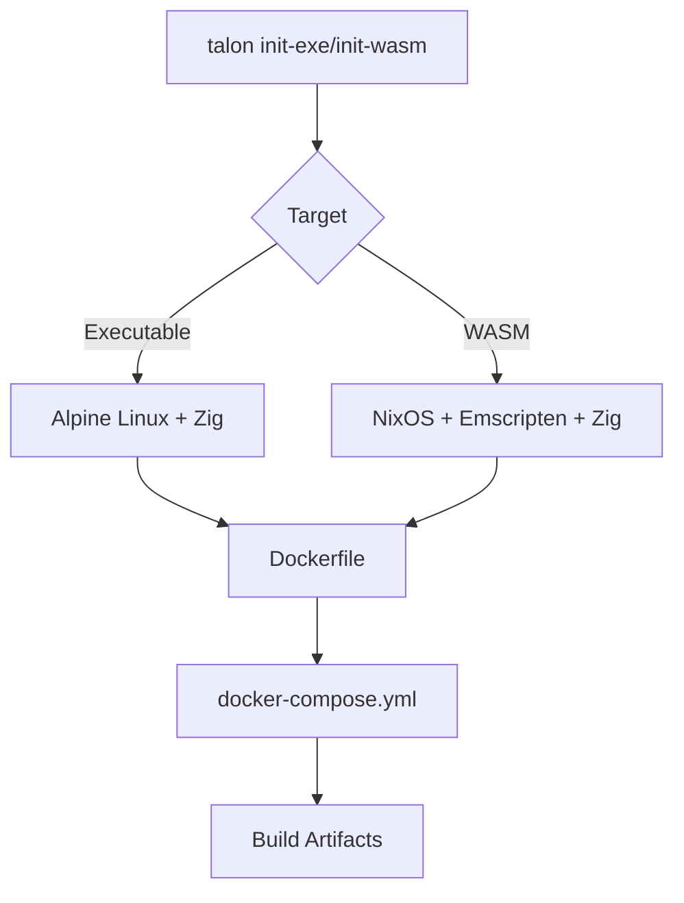

## Overview

Talon uses Docker containers to provide reproducible, cross-platform builds without requiring complex local toolchain installation. This approach ensures consistent builds across different development machines and CI/CD environments.

## Why Docker?

Building cross-platform applications requires:

- **Zig compiler** (specific version 0.14.0)
- **System libraries** (different per target platform)
- **Build tools** (native compilers, linkers)
- **For WASM**: Emscripten toolchain and dependencies

Docker encapsulates all these requirements into reproducible containers.

<Info>
You don't need to install Zig, Emscripten, or any build tools locally. Docker handles everything.
</Info>

## Architecture Overview

Talon uses different Docker base images depending on the target:



## Docker Images

### Executable Builds (Alpine-based)

**Base Image**: `alpine:latest`

**Why Alpine?**
- Small image size (~5 MB base)
- Fast downloads and builds
- Contains essential build tools

**Installed Packages**:
```dockerfile
RUN apk update && apk add curl tar xz
```

**Zig Installation**:
```dockerfile
ARG VERSION=0.14.0

RUN curl https://ziglang.org/download/$VERSION/zig-linux-$(uname -m)-$VERSION.tar.xz -O && \
    tar -xf *.tar.xz && \
    mv zig-linux-$(uname -m)-$VERSION /compiler
```

<Info>
Zig is downloaded at build time based on your system architecture (x86_64 or arm64).
</Info>

### WASM Builds (NixOS-based)

**Base Image**: `nixos/nix:latest`

**Why NixOS?**
- Declarative package management
- Reproducible builds with flakes
- Easy Emscripten integration
- Complex dependency resolution

**Nix Flake Configuration**:
```nix
{
  inputs = {
    nixpkgs.url = "nixpkgs/nixos-unstable";
    flake-utils.url = "github:numtide/flake-utils";
    zig.url = "github:mitchellh/zig-overlay";
  };

  outputs = {
    packages = with pkgs; [
      glfw              # Window management
      libGL             # OpenGL
      libxkbcommon      # Keyboard input
      pkg-config        # Build configuration
      xorg.libX11       # X11 support
      zigpkgs."0.14.0" # Zig compiler
      emscripten        # WebAssembly compiler
    ];
  };
}
```

## Docker Compose Configuration

Docker Compose orchestrates the build process, managing volumes and commands.

### Executable Build Compose File

```yaml
services:
  camera:  # Service name (matches project name)
    build:
      context: .
      dockerfile: Dockerfile
    volumes:
      - ./dist:/build/zig-out/bin  # Output directory mapping
    working_dir: /build
    command: /compiler/zig build -Dtarget=x86_64-windows
```

**Volume Mapping**:
- `./dist` (host) ↔ `/build/zig-out/bin` (container)
- Build artifacts automatically appear in your local `dist/` folder

### WASM Build Compose File

```yaml
services:
  wasm:
    build:
      context: .
      dockerfile: Dockerfile
    volumes:
      - ./dist:/build/zig-out/www  # WASM output directory
    working_dir: /build
    command: nix develop -L --verbose && zig build -Dtarget=wasm32-emscripten -Doptimize=ReleaseSmall && tail -f /dev/null
```

**Command Breakdown**:
1. `nix develop -L --verbose` - Enter Nix development shell
2. `zig build -Dtarget=wasm32-emscripten` - Compile to WASM
3. `tail -f /dev/null` - Keep container running (optional)

## Build Process Flow

<Steps>
  <Step title="Image Build">
    Docker builds the container image:
    
    ```bash
    docker-compose build
    ```
    
    This step:
    - Downloads base image (Alpine or NixOS)
    - Installs Zig compiler
    - For WASM: Sets up Emscripten and dependencies
    - Generates `build.zig` and `build.zig.zon`
  </Step>
  
  <Step title="Container Start">
    Docker starts the container:
    
    ```bash
    docker-compose up
    ```
    
    The container:
    - Mounts your project directory
    - Executes the build command
    - Writes output to the mounted volume
  </Step>
  
  <Step title="Artifact Generation">
    Build artifacts appear in `dist/`:
    
    **Executable**:
    ```
    dist/
    └── your-project.exe
    ```
    
    **WASM**:
    ```
    dist/
    ├── index.html
    ├── index.js
    └── index.wasm
    ```
  </Step>
</Steps>

## Generated Build Files

Both `init-exe` and `init-wasm` generate build configuration files inside the Docker container.

### build.zig.zon (Dependency Manifest)

```zig
.{
    .name = "your-project",
    .version = "0.0.0",
    .minimum_zig_version = "0.14.0",
    .dependencies = .{
        .wren = {
            .url = "https://github.com/wren-lang/wren/archive/refs/heads/main.zip",
            .hash = "N-V-__8AAPbpYgAZgdr-sM49A18GSKr5MVR56MwpfI65FmAZ",
        },
        .raylib = {
            .url = "git+https://github.com/raysan5/raylib#27a4fe885164b315a90b67682f981a1e03d6079c",
            .hash = "raylib-5.5.0-whq8uFqtNARw6t1tTakBDSVYgUjlBqnDppOyNfE_yfCa",
        },
        .tolan = {
            .url = "git+https://github.com/jossephus/talon#ec9dc6910fa96c414406b5ed539e441943e4aadd",
            .hash = "zig_wren-0.0.0-_Mx4iLclCACui2mzMF9z9j7iRplB0vS_jZjf-k9EQNLC",
        },
    },
}
```

<Warning>
Dependency hashes are cryptographically verified. Changing the hash will cause build failures.
</Warning>

### build.zig (Build Script)

Generated at container runtime with:
- Asset embedding logic (Wren files)
- Target-specific configuration
- Emscripten linking (WASM only)

## Docker Commands Reference

### Building

```bash
# Build the Docker image
docker-compose build

# Build without cache (force fresh build)
docker-compose build --no-cache

# Build for specific target
docker-compose run camera /compiler/zig build -Dtarget=x86_64-linux
```

### Running

```bash
# Run the default build command
docker-compose up

# Run in detached mode (background)
docker-compose up -d

# Run and remove container after completion
docker-compose run --rm wasm nix develop && zig build -Dtarget=wasm32-emscripten
```

### Debugging

```bash
# Enter container shell for debugging
docker-compose run --rm camera /bin/sh

# View build logs
docker-compose logs -f

# Inspect container
docker-compose ps
```

### Cleanup

```bash
# Stop and remove containers
docker-compose down

# Remove volumes (including dist/ mapping)
docker-compose down -v

# Remove images
docker-compose down --rmi all
```

## Customizing the Docker Setup

### Change Zig Version

Edit the `ARG VERSION` in your Dockerfile:

```dockerfile
ARG VERSION=0.15.0  # Update to newer version
```

<Warning>
Changing Zig versions may require updating dependency hashes in `build.zig.zon`.
</Warning>

### Add System Dependencies

For executables (Alpine):

```dockerfile
RUN apk add curl tar xz libpng-dev  # Add libpng
```

For WASM (NixOS):

```nix
packages = with pkgs; [
  glfw
  libGL
  zigpkgs."0.14.0"
  emscripten
  libpng  # Add new dependency
];
```

### Optimize Build Cache

Layer your Dockerfile to cache dependencies:

```dockerfile
# Cache Zig download
RUN curl https://ziglang.org/download/$VERSION/zig-linux-$(uname -m)-$VERSION.tar.xz -O && \
    tar -xf *.tar.xz

# Copy project files (changes frequently)
COPY . /build
WORKDIR /build

# Run build
RUN /compiler/zig build
```

## Multi-Stage Builds (Advanced)

Reduce final image size with multi-stage builds:

```dockerfile
# Stage 1: Build
FROM alpine AS builder
ARG VERSION=0.14.0
RUN apk add curl tar xz
RUN curl https://ziglang.org/download/$VERSION/zig-linux-$(uname -m)-$VERSION.tar.xz -O && \
    tar -xf *.tar.xz && \
    mv zig-linux-$(uname -m)-$VERSION /compiler

WORKDIR /build
COPY . /build
RUN /compiler/zig build -Doptimize=ReleaseSmall

# Stage 2: Runtime
FROM alpine AS runtime
COPY --from=builder /build/zig-out/bin/app /app
CMD ["/app"]
```

## CI/CD Integration

### GitHub Actions

```yaml
name: Build
on: [push]

jobs:
  build:
    runs-on: ubuntu-latest
    steps:
      - uses: actions/checkout@v3
      
      - name: Build Windows Executable
        run: docker-compose run --rm camera /compiler/zig build -Dtarget=x86_64-windows
      
      - name: Upload Artifacts
        uses: actions/upload-artifact@v3
        with:
          name: windows-build
          path: dist/
```

### GitLab CI

```yaml
build:
  image: docker:latest
  services:
    - docker:dind
  script:
    - docker-compose build
    - docker-compose run --rm camera /compiler/zig build -Dtarget=x86_64-windows
  artifacts:
    paths:
      - dist/
```

## Performance Tips

<Steps>
  <Step title="Use BuildKit">
    Enable Docker BuildKit for faster builds:
    
    ```bash
    export DOCKER_BUILDKIT=1
    docker-compose build
    ```
  </Step>
  
  <Step title="Mount Build Cache">
    Cache Zig build artifacts between runs:
    
    ```yaml
    volumes:
      - ./dist:/build/zig-out/bin
      - zig-cache:/build/.zig-cache  # Cache build artifacts
    
    volumes:
      zig-cache:
    ```
  </Step>
  
  <Step title="Parallel Builds">
    Build multiple targets simultaneously:
    
    ```bash
    docker-compose run -d camera /compiler/zig build -Dtarget=x86_64-windows &
    docker-compose run -d camera /compiler/zig build -Dtarget=x86_64-linux &
    wait
    ```
  </Step>
</Steps>

## Troubleshooting

### "Cannot connect to Docker daemon"

<Info>
Ensure Docker Desktop is running, or start the Docker service:

```bash
sudo systemctl start docker
```
</Info>

### "No space left on device"

Clean up Docker:

```bash
docker system prune -a
```

### Slow builds on macOS

Use Docker Desktop's VirtioFS:

1. Open Docker Desktop Settings
2. Go to "Experimental Features"
3. Enable "VirtioFS"

### Permission errors on Linux

Fix file ownership:

```bash
sudo chown -R $USER:$USER dist/
```

## Security Considerations

<Warning>
Docker containers run with elevated privileges. Only use trusted Dockerfiles and base images.
</Warning>

**Best Practices**:
- Review generated Dockerfiles before running
- Pin base image versions
- Use official images (alpine, nixos/nix)
- Scan images for vulnerabilities:

```bash
docker scan your-image:latest
```

## Next Steps

- Build [native executables](/deployment/building-executables)
- Build [WebAssembly applications](/deployment/building-wasm)
- Learn about [deployment strategies](/deployment/production)